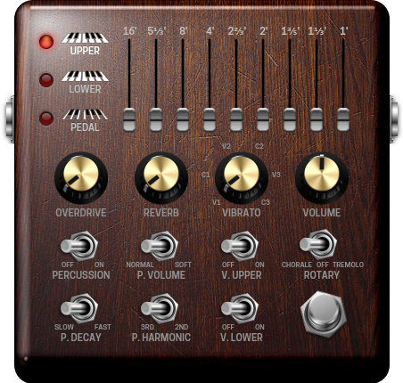

# setbfree-controller.lv2

Virtual controller based on [LV2](http://lv2plug.in/) to tune [setBfree synthetizer](http://setbfree.org).

It was designed for [Mod Devices](moddevices.com).



# Features

It uses the default MIDI settings initialized by setBfree to control:

- presets (global and upper and lower keyboard)
- 9x3 drawbars
- overdrive, reverb, volume
- percussion including few switches
- vibrato including few switches
- drawbar randomizer

MIDI notifications to update the GUI are not supported.

# Build

To build the plugin:

```
make build
```
# Install

To install it to the user space: `~/.lv2/`

```
make install-user
```

To install it to your system: `/lib/lv2`

```
make install
```

# Deploy

Deploy the plugin to the Mod Duo X. It uses the default IP and it's web service.

```
make deploy
```
